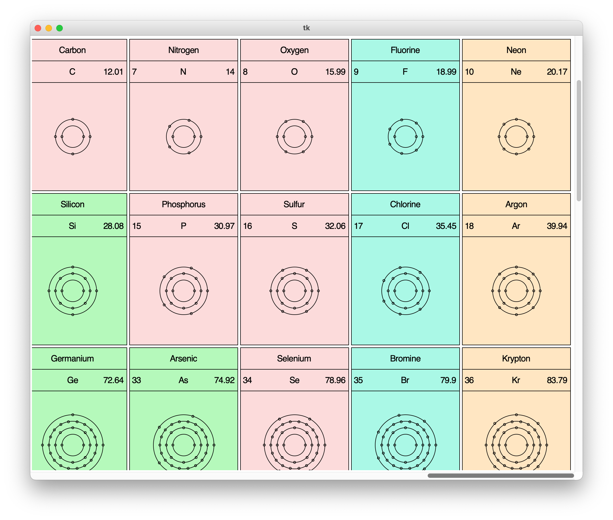

# Periodic Table

This is a Python program that displays a periodic table with the following for each element:

* Element Name
* Element Abbreviation/Symbol
* Atomic Number
* Atomic Mass
* Electron Shells

The periodic table opens in a window with scroll bars.

**NOTE**: You must drag the scrollbars in the window to pan the periodic table;
mouse scroll wheel and other such methods of scrolling do not work.



## Installation on macOS

Install `brew` if you don't have it:

```
/bin/bash -c "$(curl -fsSL https://raw.githubusercontent.com/Homebrew/install/HEAD/install.sh)"
```

Install `python3` if you don't have it:

```
brew install python
```

Install tkinter if you don't have it:

```
brew install python-tk
```

Download the code in this repository, `cd` into the directory, and run the following command:

```
python3 main.py
```